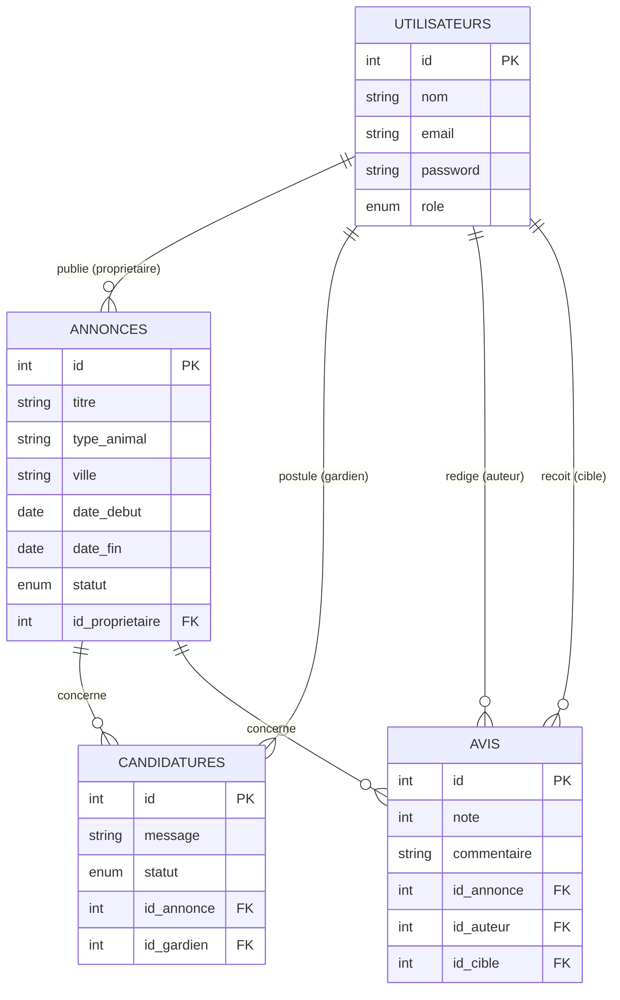
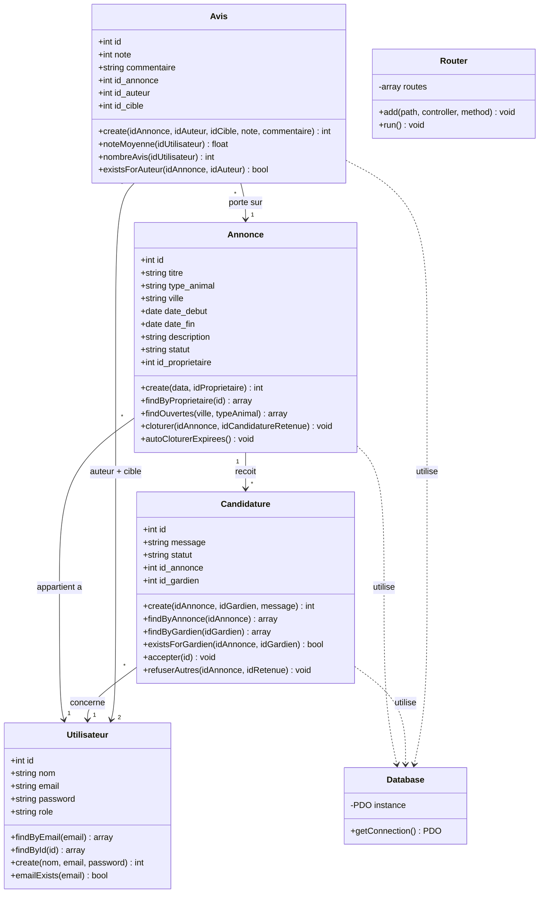

# PetSitter — Documentation technique

Projet solo (initialement prévu pour 3 étudiants) — PHP (POO), MySQL, architecture MVC.

---

## 1. Schéma relationnel (MLD)

```
utilisateurs (id, nom, email, password, role, date_inscription)

annonces (id, titre, type_animal, ville, date_debut, date_fin, description, statut, #id_proprietaire)
    #id_proprietaire → utilisateurs.id

candidatures (id, message, statut, date_candidature, #id_annonce, #id_gardien)
    #id_annonce → annonces.id
    #id_gardien → utilisateurs.id
    UNIQUE (id_annonce, id_gardien)

avis (id, note, commentaire, date, #id_annonce, #id_auteur, #id_cible)
    #id_annonce → annonces.id
    #id_auteur  → utilisateurs.id
    #id_cible   → utilisateurs.id
    UNIQUE (id_annonce, id_auteur)
```

### Diagramme entité-relation



### Choix de conception : pas de champ "rôle propriétaire/gardien"

Le champ `role` de `utilisateurs` sert uniquement à distinguer `user` / `admin`. Un même utilisateur peut être propriétaire d'une annonce (via `annonces.id_proprietaire`) et gardien sur une autre (via `candidatures.id_gardien`) — la casquette est **contextuelle**, déterminée par la table concernée, pas par un attribut fixe sur l'utilisateur. Ça colle exactement à l'énoncé ("un même utilisateur peut être propriétaire et gardien selon les annonces") sans dupliquer l'information.

---

## 2. Diagramme de classes



**Remarque sur les méthodes statiques** : l'ensemble des classes métier (`Annonce`, `Candidature`, `Avis`, `Utilisateur`) utilise des méthodes **statiques** plutôt que des instances classiques, chaque méthode ouvrant sa propre connexion via `Database::getConnection()` (singleton partagé). C'est un choix délibéré pour un projet solo : plus rapide à écrire et à maintenir seul, tout en gardant une vraie séparation des responsabilités par classe (chaque classe ne manipule que sa propre table). La méthode `cloturer()` prend `$idAnnonce` en paramètre explicite plutôt que de reposer sur `$this->id`, ce qui est fonctionnellement équivalent à une version orientée objet avec instances, mais plus simple à exploiter avec des méthodes statiques.

---

## 3. Logique métier détaillée

### 3.1 Clôture d'une annonce (validation d'un gardien)

Déclenchée par `AnnonceController::valider()` → `Annonce::cloturer($idAnnonce, $idCandidatureRetenue)`.

**Étapes (dans une transaction PDO)** :
1. Le statut de l'annonce passe de `ouverte` à `pourvue`.
2. La candidature retenue passe de `en_attente` à `acceptee` (`Candidature::accepter()`).
3. Toutes les **autres** candidatures de cette même annonce passent automatiquement à `refusee` (`Candidature::refuserAutres()`), via une seule requête `UPDATE ... WHERE id_annonce = :id AND id != :id_retenue`.
4. Si une étape échoue, `rollBack()` annule tout — l'annonce ne peut jamais se retrouver dans un état incohérent (ex : pourvue mais sans gardien accepté).

**Sécurité associée** : avant d'appeler `cloturer()`, le contrôleur vérifie que l'utilisateur connecté est bien le propriétaire de l'annonce, **et** que la candidature soumise appartient bien à cette annonce précise (empêche de valider une candidature d'une autre annonce en falsifiant les données du formulaire).

### 3.2 Clôture automatique (garde terminée)

`Annonce::autoCloturerExpirees()` exécute :
```sql
UPDATE annonces SET statut = 'terminee'
WHERE statut = 'pourvue' AND date_fin < CURDATE()
```
Appelée à chaque chargement des pages `mes-annonces` et `avis/noter`, cette méthode fait transitionner automatiquement toute annonce `pourvue` dont la date de fin est dépassée. Pas besoin de tâche planifiée (cron) : la vérification se fait à la volée, ce qui suffit largement pour l'usage du projet.

### 3.3 Calcul de la note moyenne (réputation)

`Avis::noteMoyenne($idUtilisateur)` :
```sql
SELECT AVG(note) AS moyenne FROM avis WHERE id_cible = :id
```
La moyenne est calculée **à la volée** à chaque appel (pas de colonne `note_moyenne` stockée en dur sur `utilisateurs`) — ça garantit que la valeur affichée est toujours exacte, sans risque de désynchronisation entre une colonne cache et les avis réels. Le résultat est arrondi à 1 décimale (`round(..., 1)`) et retourne `null` si l'utilisateur n'a aucun avis, affiché côté vue comme "pas encore noté".

**Qui peut noter qui** : la cible d'un avis n'est **jamais** transmise par le formulaire. `AvisController::noter()` la recalcule côté serveur à partir du rôle réel de l'utilisateur connecté sur cette garde précise (propriétaire de l'annonce → il note le gardien dont la candidature est `acceptee` ; gardien accepté → il note le propriétaire). Ça empêche qu'un utilisateur malveillant puisse noter n'importe qui en modifiant le formulaire.

**Contraintes appliquées** : un avis n'est possible que si l'annonce est au statut `terminee` (vérifié en PHP), et la contrainte `UNIQUE (id_annonce, id_auteur)` en base empêche un même utilisateur de noter deux fois la même garde, même en cas de double soumission du formulaire.

---

## 4. Règles métier — récapitulatif

| Règle | Où elle est appliquée |
|---|---|
| Un gardien ne peut pas postuler deux fois à la même annonce | `UNIQUE(id_annonce, id_gardien)` en base + vérif `Candidature::existsForGardien()` en PHP |
| Un propriétaire ne valide qu'un seul gardien ; les autres sont auto-refusées | `Annonce::cloturer()` |
| Un avis n'est possible que sur une garde "Terminée", une seule fois par utilisateur | Vérif statut en PHP + `UNIQUE(id_annonce, id_auteur)` en base |
| Mots de passe hachés | `password_hash()` / `password_verify()` partout, jamais de mot de passe en clair stocké |
| Requêtes préparées partout | `PDO::ATTR_EMULATE_PREPARES => false` + paramètres nommés sur toutes les requêtes |
| Un utilisateur ne voit que ses propres données | Vérification `id_proprietaire === $_SESSION['user_id']` (et équivalent côté gardien) sur chaque action sensible |
| Seul l'admin accède à la modération | `AdminController::requireAdmin()` vérifie `$_SESSION['user_role'] === 'admin'` |
